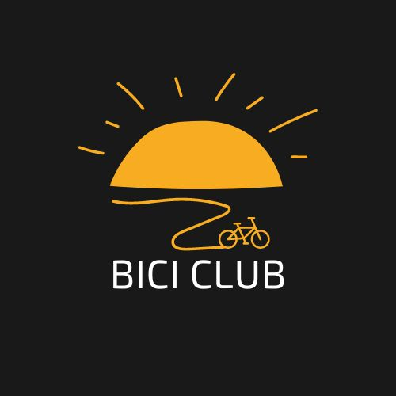

#Crypto Bici Club

## Collaborative and open source work carried out by the [Podemos Aprender](https://discord.gg/gymbmn7w) community

Project that consists of the development of a club of urban cyclists who, in a decentralized and independent way, use their bicycle to get around the city, adding points and obtaining rewards in the form of collectible NFTs.

---

### Used Technologies:

The project uses the Ethereum network (Polygon?) and is developed in Solidity ( version 0.8.7).

## The user interacts through a web application developed in React Js.

- Story Mapping: In the following link you can access the user stories of the project: https://docs.google.com/spreadsheets/d/1LM-bXEJ9QSBDHvsnUHnD5yD21ejBiYcB5ZzfQ7cSyTo/edit#gid=0

---

- Project notes: https://docs.google.com/document/d/1dILDQA-4Cn8e4Ty8eLhn7fd79VIZrlFqt_3OBYYCh7c/edit

---

---

#Crypto Bici Club

## Trabajo colaborativo y open source realizado por la comunidad de [Podemos Aprender](https://discord.gg/gymbmn7w)

Proyecto que consiste en el desarrollo de un club de ciclistas urbanos que, de manera descentralizada e independiente, utilizan su bicicleta para desplazarse en la ciudad, sumando puntos y obteniendo recompensas en forma de NFT’s coleccionables.

---

### Tecnologías utilizadas:

El proyecto utiliza la red de Ethereum (Polygon?) y está desarrollado en Solidity ( versión 0.8.7).

El usuario interactúa mediante una aplicación web desarrollada en React Js.

---

- Story Mapping: En el siguiente link se puede acceder a las historias de usuario del proyecto: https://docs.google.com/spreadsheets/d/1LM-bXEJ9QSBDHvsnUHnD5yD21ejBiYcB5ZzfQ7cSyTo/edit#gid=0

---

- Notas del proyecto: https://docs.google.com/document/d/1dILDQA-4Cn8e4Ty8eLhn7fd79VIZrlFqt_3OBYYCh7c/edit
